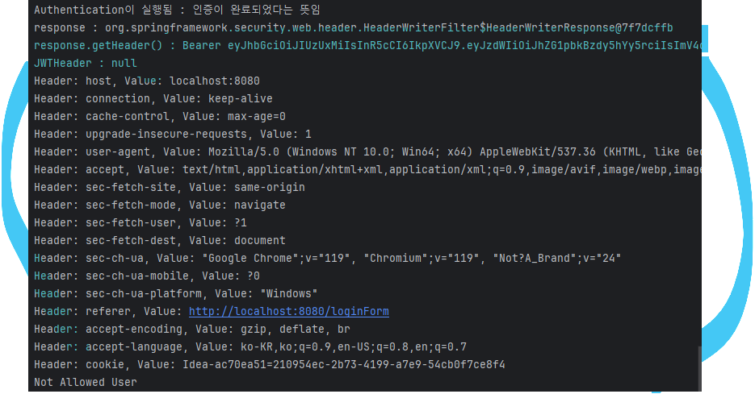

member_role 테이블은 수정 불가하게 만듦. DB관리자가 아니라면 역할을 추가하거나 할 필요가 없음.\
추가할 내용이 있으면 sql workbench에서 직접 insert 할 것.

기본적으로 회원가입을 할 경우 member_role은 ROLE_USER로 설정,
권한 변경이 필요할 경우 ROLE_MANAGER나 ROLE_ADMIN이 변경할 수 있도록 함.

============================\
[11/22]
AuthenticationFilter와
login에 성공하고 redirectURL에 response를 날려서
AuthorizationFilter에서 받아내는데,
왜 AuthorizationFilter에서 response.getHeader()의 값이 null인가?
